<div align="center">

# Rakshann Velamuri

<p>
Computer Science Undergraduate • Backend Developer • Cloud Enthusiast • Open Source Contributor
</p>

</div>

---

<div align="center">

```console
rakshann@github:~$ ./contributions.sh
```



<br><br>

```console
rakshann@github:~$ whoami
```

<table>
  <tr>
    <td width="54%" valign="top">
      
    </td>
    <td width="46%" valign="top">
      
    </td>
  </tr>
</table>

<br>

<p>
  <a href="https://github.com/rakshann05">GitHub</a>
  •
  <a href="https://linkedin.com/in/rakshannvelamuri">LinkedIn</a>
  •
  <a href="https://leetcode.com/u/Rakshann">LeetCode</a>
  •
  <a href="mailto:rakshannvelamuri@gmail.com">Email</a>
</p>

</div>

---

# 💫 About Me

I'm a **Computer Science Engineering Undergraduate** at **Amrita Vishwa Vidyapeetham** passionate about building scalable backend systems, cloud-native applications, and real-time collaborative platforms.

### Interests

- 🚀 Backend Development
- ☁️ Cloud Computing
- 🏗 Distributed Systems
- 🤖 Artificial Intelligence
- 🔐 Cybersecurity
- 🌍 Open Source

---

# 🚀 Featured Projects

## 🚀 NexusForge

Production-grade backend platform implementing secure authentication, RBAC, JWT session management, refresh token rotation, audit logging, and scalable APIs.

**Tech Stack**

`Java` • `Spring Boot` • `JWT` • `PostgreSQL`

---

## 🌩 DEWD Dashboard

Cloud-native disaster early warning dashboard powered by Google Cloud services and Vertex AI.

**Tech Stack**

`Python` • `Google Cloud` • `BigQuery` • `Cloud Functions` • `Vertex AI`

---

## 📱 Analyn

Flutter application connecting therapists and clients with authentication, scheduling, and Firebase integration.

**Tech Stack**

`Flutter` • `Firebase` • `Dart`

---

## 💻 OLabs Collab

Real-time collaborative learning platform featuring

- Live Code Editor
- WebRTC Video Calling
- AI Chatbot
- Shared Whiteboard
- Voice Chat
- STEM Quiz Platform

**Tech Stack**

`React` • `JavaScript` • `Flask` • `WebRTC`

---

## 🏨 Hotel Management System

Database-driven hotel management application supporting room booking, restaurant ordering, billing, and administration.

**Tech Stack**

`SQL` • `MySQL`

---

# 🛠 Tech Stack

### 💻 Languages

- Java
- Python
- JavaScript
- C
- C++
- SQL

### 🎨 Frontend

- React
- HTML
- CSS
- Flutter

### ⚙️ Backend

- Spring Boot
- Flask
- Node.js

### 🗄 Database

- PostgreSQL
- MySQL
- Firebase

### ☁️ Cloud

- AWS
- Google Cloud Platform

### 🛠 Tools

- Git
- GitHub
- Docker
- Postman
- VS Code

---

# 📜 Certifications

- 🏅 Data Science & Machine Learning
- ☁️ Cloud Computing
- 🔒 Cloud Security Concepts, Services & Compliance
- 🛡 Microsoft Security Essentials Professional Certification

---

<div align="center">


</div>

<div align="center">

> **"Build with curiosity. Learn continuously. Deliver with impact."**

⭐ **Thanks for visiting my profile!**

</div>
